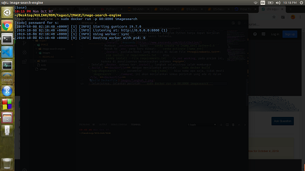
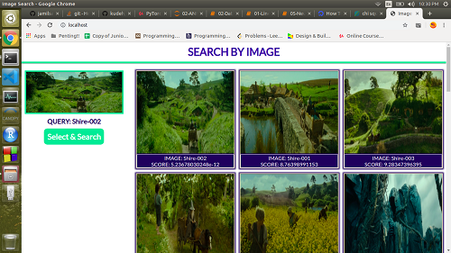
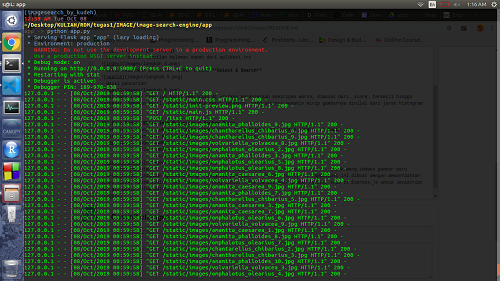

# Indeks Gambar Menggunakan Aplikasi Image-Search-Engine

Developer: [Kudeh](https://github.com/kudeh)  
Penulis: M. Salsabila Jamil

**Image Search Engine** adalah sebuah aplikasi yang digunakan untuk mencari gambar yang "mirip-mirip" di dasarkan pada warna. Aplikasi ini dibuat menggunakan bahasa **[Python](https://www.python.org/)**.
Karenanya harus _install_ Python dulu jika belum punya.

Tujuan aplikasi:
- Diberikan sebuah gambar, maka akan ditampakkan gambar lainnya yang memiliki kesamaan warna

Teknik yang digunakan untuk menentukan gambar yang memiliki kesamaan - pada aplikasi ini - warna adalah _chi squared distance_ atau pengukuran jarak menggunakan _chi squared_. Jarak yang diukur pada aplikasi ini adalah jarak antar _histogram_ warna dari 2 gambar berbeda/sama. [[ref 1](https://en.wikipedia.org/wiki/Content-based_image_retrieval)] [[ref 2](https://stats.stackexchange.com/questions/184101/comparing-two-histograms-using-chi-square-distance)]

Penulis menjalankan aplikasi ini pada _Operating System_ Ubuntu 16.04 LTS 64bit
[Download Ubuntu](https://ubuntu.com/download/desktop)

Langkah pertama, yaitu men-_download_ berkas [image-search-engine](https://github.com/kudeh/image-search-engine) [[MIT License]](https://github.com/kudeh/image-search-engine/blob/master/LICENSE). Ada 2 cara:
- Melalui terminal: ```git clone https://github.com/kudeh/image-search-engine```

- Download manual

Langkah kedua masuk ke direktori hasil _download_
- ```cd image-search-engine```

Setelah masuk, maka terpapar beberapa file dan folder:
- Folder
    - app/
- File
    - Dockerfile
    - LICENSE
    - Procfile
    - README.md
    - requirements.txt

Terdapat 2 cara dalam menjalankan aplikasi ini:
- Menggunakan aplikasi **Docker**
- Masuk ke folder ```app/```, kemudian jalankan perintah ```python app.py```

### Cara Pertama
- _Install_ ***Docker*** ke dalam komputer terlebih dahulu (jika belum ada). Untuk lebih jelas bagaimana prosedur instalasi ***Docker***, dapat dibaca pada tautan [ini](https://docs.docker.com/install/#supported-platforms).
- ***requirements.txt***. Isi _file_ ini adalah modul/pustaka yang mesti di _download_/_install_ terlebih dahulu sebelum menjalankan program ini. Ada 2 cara:
    - Menggunakan pip: ```sudo apt install python-pip```
    - Menggunakan aplikasi [Anaconda](https://www.anaconda.com/), dengan cara membuat sebuah _environment_ baru, sehingga nantinya versi pustaka/modul yang akan di-_download_ tidak mengalami **konflik** dengan versi pustaka/modul yang telah di-_download_ sebelumnya. Karena beberapa program Python hanya dapat berjalan menggunakan pustaka/modul dengan versi tertentu.
    - Penulis menggunakan cara kedua:
        - _Install_ [Anaconda](https://www.anaconda.com/distribution/)
        - Membuat _environment_ baru: ```conda create -n [nama_env] python=3.6```
        - Masuk ke _env_ yang baru dibuat: ```conda activate [nama_env]```
        - _Install_ pustaka/modul yang ditulis di dalam file **requirements.txt**: ```pip install -r requirements.txt``` atau
        ```conda install --file requirements.txt``` (*_not working_ pada projek ini, karena di penulisannya menyesuaikan pedoman **pip**)  
        
- Setelah _Docker_ sukses ter-_install_, langkah selanjutnya ialah membangun (_build_) ***Dockerfile*** dengan menjalankan perintah ```sudo docker build --tag=imagesearch .```, parameter ```--tag=[nama]``` bisa nama apa saja, tidak mesti ```imagesearch```. Tanda titik (.) artinya "_current working directory_" (direktori yang anda saat ini sedang berada), **WAJIB** ada file **Dockerfile**, **Procfile**. Perintah ini akan menjalankan semua perintah yang ada di dalam _file_ ***Dockerfile***  


Langkah ketiga, jalankan perintah ```sudo docker run -p 80:8000 imagesearch```. Maksud perintah ini adalah "jalankan **imagesearch** pada _port_ 80:8000 dengan alamat _localhost_, dimana _port_ 80 adalah _port_ yang akan diakses melalui _host machine_, localhost:80, sedangkan untuk menyambungnya ke _virtual machine_ **imagesearch** ialah menggunakan _port_ 8000 yang telah di-_set_ sebelumnya".  

- Berikut adalah tampilan halaman depan dari aplikasi ini  

- Untuk melakukan pencarian, tekan tombol **Select & Search**  

- Hasil pencarian  
  
Dapat anda lihat tampilan hasil pencarian di urutkan berdasarkan kemiripan warna, dimulai dari _score_ terkecil hingga terbesar. Semakin kecil _score_, semakin dekat jaraknya, yang artinya semakin mirip gambarnya dinilai dari jarak histogram warna.

### Cara Kedua: Eksperimen Menggunakan Gambar Jamur
Kudeh menjelaskan, untuk meng-indeks gambar baru, perlu dijalankan langkah-langkah di bawah ini:
- Masukkan gambar baru ke dalam folder ```app/static/images```  

- ```cd app``` *Jika belum berada di folder 'app'
- ```pip install -r requirements.txt```  

- Jalankan perintah: ```python index.py --dataset static/images --index index.csv```, untuk meng-indeks gambar baru
- Selanjutnya, jalankan aplikasi dengan mengetik perintah: ```python app.py```, *applikasi ini dibuat dengan memanfaatkan modul Flask. Flask adalah _web framework_ yang dibuat untuk bahasa pemrograman Python, seperti Express.js untuk Javascript dan gin-gonic untuk Golang.  

- Buka browser, ketikkan alamat: ```http://0.0.0.0:5000/```, maka akan tampil di layar monitor anda halaman seperti di bawah ini  

- Jika ingin mencari, klik tombol ***Select & Search***  

- Hasil pencarian  


## TERIMA KASIH TELAH MEMBACA SAMPAI HABIS

